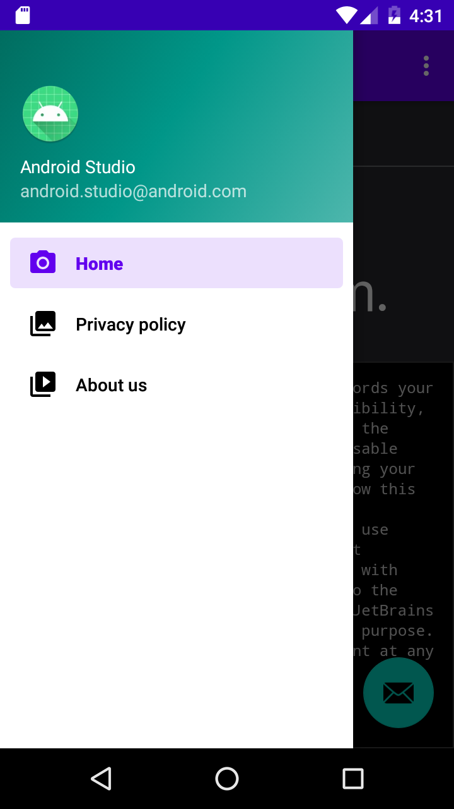
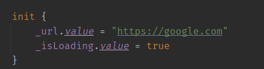

# Kotlin-Webview-Example
### Kotlin WebView Sample App

This is a sample Android app that demonstrates how to load a web page into a WebView component using Kotlin programming language.
Screenshots

Screenshot 1

Screenshot 2

## Features

1. Loads a web page into a WebView component
2. Displays a progress bar while the page is loading
3.[TODO] Handles errors and displays appropriate messages

## Libraries

- AndroidX core library
- AndroidX appcompat library
- Material Design library
- ConstraintLayout library
- Android Architecture Components
- Android Navigation Component

## Requirements

- Android Studio 4.0 or higher
- Android SDK 21 or higher
- Kotlin 1.8.x or higher

## Installation

- Clone this repository to your local machine using https://github.com/Kisheo/Kotlin-Webview-Example.git
- Open the project in Android Studio
- Run the app on an emulator or a physical device

## Usage

- Enter a URL in the HomeViewModel.

- The web page will be loaded into the WebView component.
- If an error occurs, The error page will be displayed.

## License

This project is licensed under the MIT License - see the LICENSE.md file for details.

### Made With ❤️ By Innocent Kisheo
